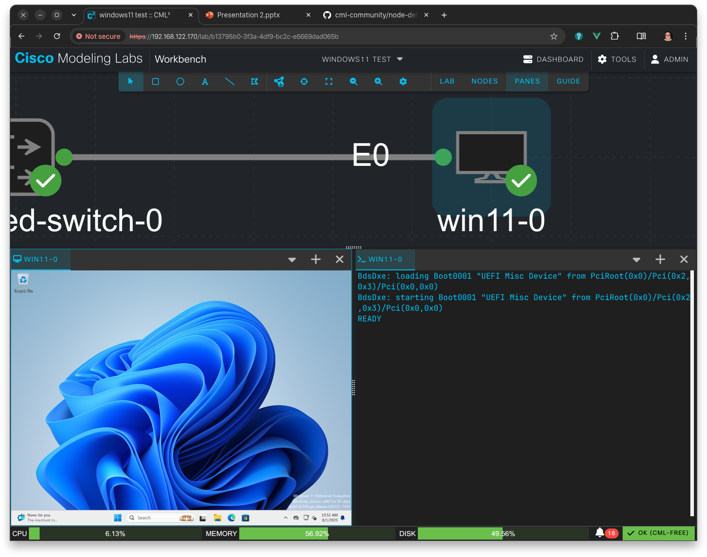

# README


Video: <https://youtu.be/LtEGmzRKAfY>

This is just a simple script which creates a Windows 11 VM, provided that
all the pre-requisites are in place (e.g. in the local directory):

- The Windows 11 installation ISO
- The Virtio driver ISO

It also expected to be run on a CML controller where all the other requirements
are already in place. These include

- Qemu (qemu-system-x86)
- OVMF / UEFI files

## Procedure

> [!NOTE]
>
> Ensure that SSH is enabled for the CML host (`systemctl status ssh`, if it is
> disabled then enable it via `systemctl enable --now ssh`, disable it after
> the). VM creation is done if you don't need or want it with
> `systemctl disable --now ssh`. This can be done via Cockpit.

1. Make sure that you have a VNC client on your local machine (like Remmina or
   TightVNC or RealVNC, …). You also need an SSH client.
1. Upload the Windows and driver ISOs and the `win11.sh` script to the CML
   controller:

   ```bash
   scp -P1122 *.iso win11.sh sysadmin@192.168.123.123:
   ```

   Replace the IP so that it matches your CML controller IP.

1. Login to the CML host from you local machine using an SSH client and ensure
   that you port forward 5901 to localhost 5901:

   ```bash
   ssh -p1122 -L5901:localhost:5901 sysadmin@192.168.123.123
   ```

   Replace the IP so that it matches your CML controller IP.

1. Ensure that the referenced ISOs from the `win11.sh` do exist in the current
   directory. Also ensure that the memory and CPU settings are OK for your
   CML installation. At a minimum, use 4 GB and 2 CPUs.
1. Then run the script using `bash ./win11.sh`, provide the user's password when
   prompted (this is needed to access `/dev/kvm` and to create the network
   device).
1. After the VM is running, open the VNC client on your local machine and
   connect it to `localhost:5901`. You should get the boot screen of the Windows
   VM running on the CML controller. You likely need to restart the VM by sending
   a Ctrl-Alt-Del to it (depends on your VNC client how to do hat) and then press
   any key when instructed on screen to start the installation process.

Refer to the video for detailed installation instructions!

## Links

- Windows 11 ISO from Microsoft (eval version)
  - <https://www.microsoft.com/en-us/evalcenter/evaluate-windows-11-enterprise>
  - <https://www.microsoft.com/en-us/software-download/windows11>

- Virtio driver ISO from Redhat
  - <https://fedorapeople.org/groups/virt/virtio-win/direct-downloads/archive-virtio/virtio-win-0.1.271-1/>

- Windows 11 node definition YAML from the DevNet CML repo
  - <https://github.com/CiscoDevNet/cml-community/tree/master/node-definitions/microsoft/Windows11>
