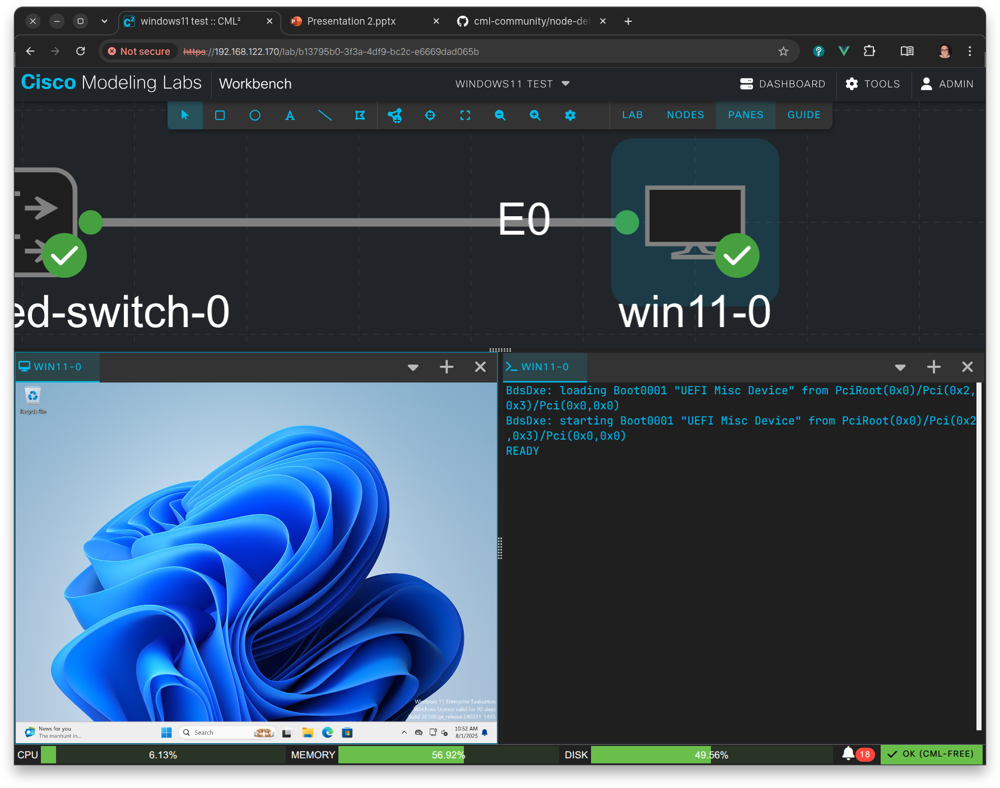

# README


Video: <https://youtu.be/LtEGmzRKAfY>

This is just a simple script which creates a Windows 11 VM, provided that
all the pre-requisites are in place (e.g. in the local directory):

- The Windows 11 installation ISO
- The Virtio driver ISO

It also expected to be run on a CML controller where all the other requirements
are already in place. These include

- Qemu (qemu-system-x86)
- OVMF / UEFI files

## Procedure

> [!NOTE]
>
> Ensure that SSH is enabled for the CML host (`systemctl status ssh`, if it is
> disabled then enable it via `systemctl enable --now ssh`, disable it after
> the). VM creation is done if you don't need or want it with
> `systemctl disable --now ssh`. This can be done via Cockpit.

1. Make sure that you have a VNC client on your local machine (like Remmina or
   TightVNC or RealVNC, …). You also need an SSH client.
1. Upload the Windows and driver ISOs and the `win11.sh` script to the CML
   controller:

   ```bash
   scp -P1122 *.iso win11.sh sysadmin@192.168.123.123:
   ```

   Replace the IP so that it matches your CML controller IP.

1. Login to the CML host from you local machine using an SSH client and ensure
   that you port forward 5901 to localhost 5901:

   ```bash
   ssh -p1122 -L5901:localhost:5901 sysadmin@192.168.123.123
   ```

   Replace the IP so that it matches your CML controller IP.

1. Ensure that the referenced ISOs from the `win11.sh` do exist at the
   specified locations in the `config.env` file. Also ensure that the memory
   and CPU settings are OK for your CML installation. At a minimum, use 4 GB
   and 2 CPUs.

   Configuration can be provided via `config.env` (next to `win11.sh`) and/or
   via environment variables / command-line flags. Environment variables and
   flags override `config.env`.

   ISO paths can be either relative to the working directory or absolute paths.
   `~/...` is supported (expanded to your home directory).

   > **NOTE**
   > Consider moving the working directory (ISOs/disks) to a location like `/var/windows`.

   > **NOTE**
   > The default TPM socket/state directory is `/tmp/tpm-dir` (chosen to
   > avoid AppArmor denials). Override via `TPM_DIR=...` or `--tpm-dir ...`
   > only if needed.

1. To install Windows, run the script in install mode using `./win11.sh --install`,
   provide the user's password when
    prompted (this is needed to access `/dev/kvm`, to run QEMU, and (optionally)
    to configure the TAP interface when `--net` is used).
1. After the VM is running, open the VNC client on your local machine and
   connect it to `localhost:5901`. You should get the boot screen of the Windows
   VM running on the CML controller. You likely need to restart the VM by sending
   a Ctrl-Alt-Del to it (depends on your VNC client how to do hat) and then press
   any key when instructed on screen to start the installation process.

Run modes:

- Default: starts from an existing base disk via an overlay clone (no ISOs)
- Install: `./win11.sh --install` (attaches Windows + Virtio ISOs)

Refer to the video for detailed installation instructions!

**In particular:**

> [!IMPORTANT]
> Some devices used for the VM are different from what is shown in the video.
> In particular, video and disk storage drivers must be adapted -- see below
> for the name

- install disk driver early on to see the disk drive
  - By default use the disk driver in `\amd64\w11` for PCI (works with CML)
  - When using SCSI then use `\vioscsi\w11\amd64` (does **not** work with CML)
- after copying the base system and after the first reboot, use Shift-F10 to
  get a terminal and disable BitLocker  
  `reg add HKLM\SYSTEM\CurrentControlSet\Control\BitLocker /v PreventDeviceEncryption /t REG_DWORD /d 1 /f`
  This should be done as soon as possible after the first reboot. Some VNC
  clients allow copy/paste (send as keystrokes)
- install the Ethernet and video driver after creating the user
  (use `\NetKVM\w11\amd64` for Ethernet and `\viogpudo\w11\amd64` for video)
- disable updates for App store and Windows Update (via GPO)
- create READY task in Taskmanager
- disable power management in settings app (screen/system sleep: never)
- disable hibernation `powercfg /HIBERNATE off` (in admin shell)
- run Edge once to go through all the "first time run steps"
- shut down the system

## Optional disk compression

After the VM was shutdown you can save some additional disk space by compressing
the resulting disk image file. Do this by running:

```plain
qemu-img convert -pc -O qcow2 win11.qcow2 win11-compressed.qcow2
```

Check results via `ls -lh`, if satisfied then replace the original file with
the new one:

```plain
rm win11.qcow2 && mv win11-compressed.qcow2 win11.qcow2
```

## Start From Existing Disk

Once you have an installed base disk (`win11.qcow2` by default), you can start a
VM without attaching the installation ISOs. The script creates a qcow2 overlay
clone (default: `win11-clone.qcow2`) using the base disk as the backing file,
unless it already exists.

```bash
./win11.sh

# explicitly pick base/clone and AppArmor-friendly paths
./win11.sh --workdir /var/windows --base-disk win11.qcow2 --clone-disk win11-lab1.qcow2

# enable networking (creates TAP and attaches to bridge)
./win11.sh --net

# install mode with networking (not recommended, install offline)
./win11.sh --install --net
```

## Networking

Networking is disabled by default. To enable it, use `--net`, which creates the
TAP interface (default: `tap0`) and attaches it to the bridge (default: `virbr0`).

```bash
./win11.sh --install --net

# customize interface names
./win11.sh --install --net --tap-ifname tap0 --bridge virbr0
```

## Cleanup

To remove generated artifacts in case they are not needed anymore (careful):

```bash
./win11.sh --clean
```

## Links

- Windows 11 ISO from Microsoft (eval version)
  - <https://www.microsoft.com/en-us/evalcenter/evaluate-windows-11-enterprise>
  - <https://www.microsoft.com/en-us/software-download/windows11>

- Virtio driver ISO from Redhat
  - <https://fedorapeople.org/groups/virt/virtio-win/direct-downloads/archive-virtio/virtio-win-0.1.271-1/>

- Windows 11 node definition YAML from the DevNet CML repo
  - <https://github.com/CiscoDevNet/cml-community/tree/master/node-definitions/microsoft/Windows11>
